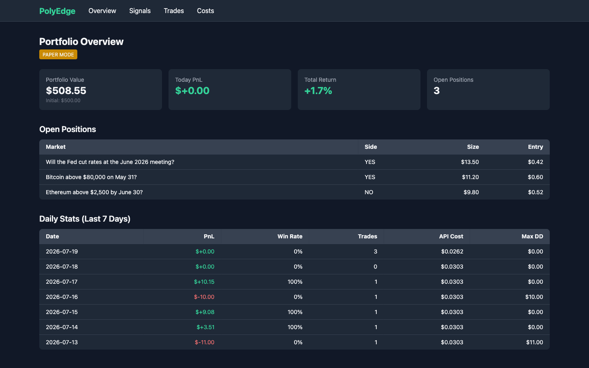
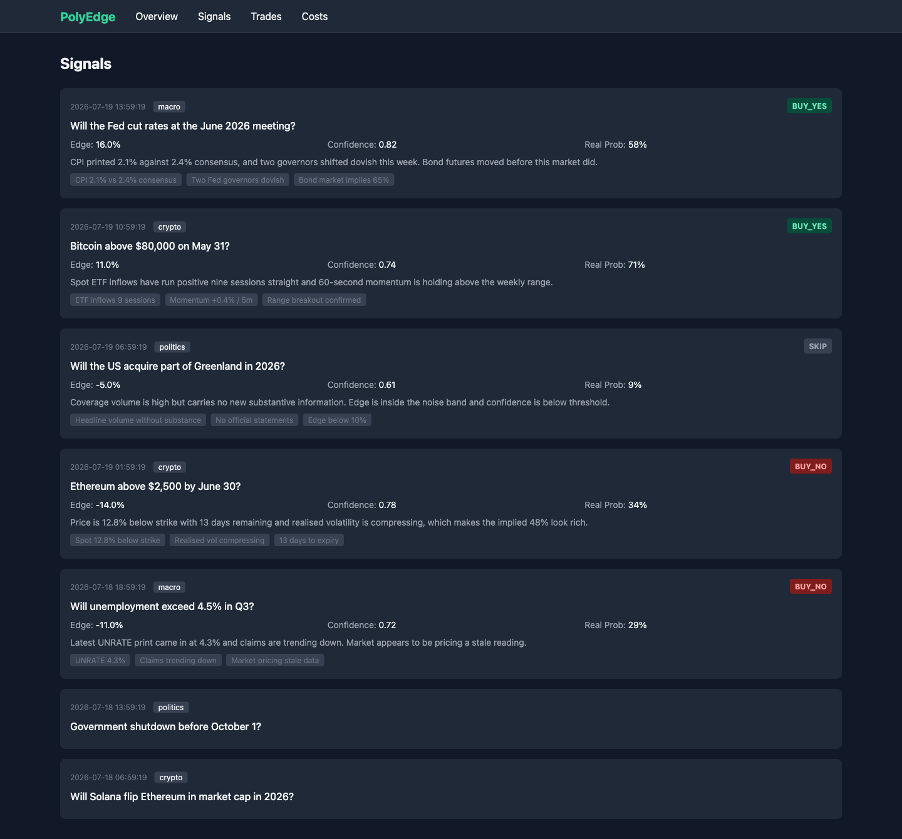
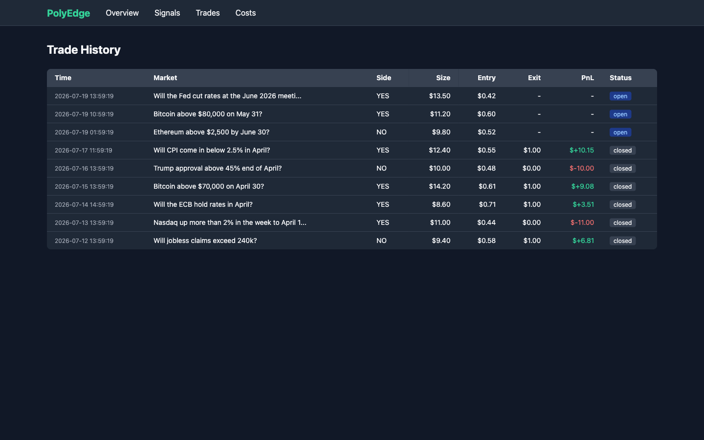
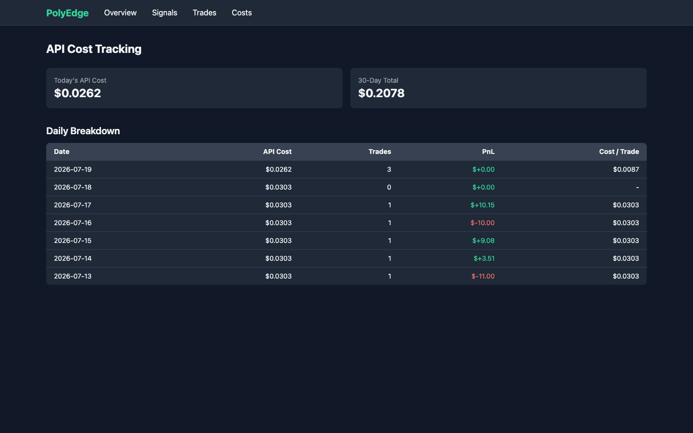
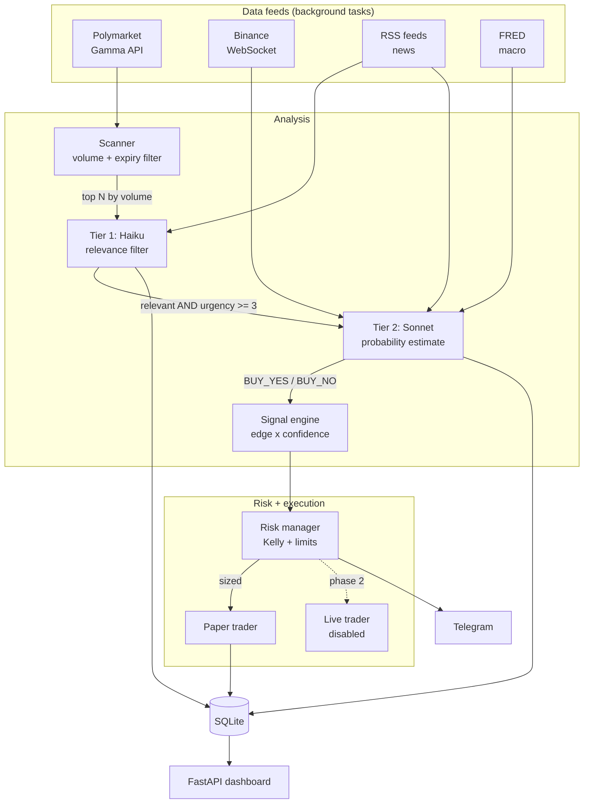

<div align="center">


<br>

### Prediction-market research with a two-stage model pipeline and per-call cost tracking.

<br>

<a href="#installation"></a> <a href="LICENSE"></a> <a href="#features"></a> <a href="https://github.com/AdrianAdem/polyedge"></a>

<br><br>

<a href="#screenshots">Screenshots</a> &nbsp; · &nbsp; <a href="#installation">Get started</a> &nbsp; · &nbsp; <a href="#license">License</a>

<br><br>

</div>

<br>

## The problem

Prediction markets price events continuously, but the news that moves those prices arrives faster than most participants re-evaluate their positions. A market on "Will the Fed cut rates in June?" may sit at $0.42 for hours after a CPI print that should have moved it. Spotting that gap manually means watching hundreds of markets and several news feeds at once.

PolyEdge automates the watching. It scans open Polymarket contracts, correlates them with live news, macro releases and crypto price action, and asks an LLM to produce a probability estimate. When that estimate diverges far enough from the market price — with enough confidence, and in a market liquid enough to trade — it sizes the position and pushes an alert.

The scan budget is explicit: by default, at most 40 candidates reach the first model per scan. Only relevant, urgent candidates advance to the second model. The market universe is larger than the analysis budget; API cost depends on scan frequency, model prices and how many candidates advance.

<br>

## Features

- **Two-tier LLM pipeline** — a cheap Haiku pass filters every candidate for relevance; only markets flagged relevant *and* urgent reach the expensive Sonnet analysis. Prompt caching is enabled on both system prompts.
- **Multi-source context** — Polymarket prices, Binance trade streams (30-minute rolling momentum and realised volatility), RSS news with fuzzy deduplication, and FRED macro series (CPI, Fed funds, unemployment, GDP).
- **Quarter-Kelly position sizing** — capped at 0.5% of portfolio per trade, with daily exposure limits, a hard stop at 0.4% daily loss, a maximum of 5 concurrent positions, and rejection of illiquid (>5% spread) or near-expiry markets.
- **Paper trading by default** — simulated fills at live prices, settled against real market resolutions. Live execution is a deliberate stub that raises `NotImplementedError`.
- **Cost accounting** — every API call logs tokens, latency and USD cost to SQLite, queryable per day and per trade.
- **Telegram control** — signal alerts plus `/status`, `/history`, `/pause`, `/resume`, `/costs`.
- **Server-rendered dashboard** — FastAPI and Jinja2, no frontend framework: portfolio, signals, trade history, cost tracking.
- **Parsing and limits** — JSON parse failures are handled, but schema, type and value validation is incomplete. Feed failures can leave reduced context while the scan loop continues; this is not a guarantee that every upstream failure halts analysis.

<br>

## Screenshots

> Screenshots show paper-trading demo data, not a live track record.

**Portfolio overview** — value, daily PnL, open positions and a seven-day breakdown.



<details>
<summary>More product screens and details</summary>

**Signal feed** — each verdict with edge, confidence, the model's probability estimate, its reasoning and key factors. Markets the Tier 1 filter rejected appear without a verdict, so the filtering itself stays auditable.



**Trade history** — entry, exit and settled PnL per position.



**API cost tracking** — spend per day and per trade, the metric the two-tier design exists to control.



**Telegram alert** — the format pushed on every approved signal:

```
🎯 SIGNAL: BUY_YES
Market: "Will the Fed cut rates at the June 2026 meeting?"
Current Price: $0.42 (42%)
Edge: 16.0%
Confidence: 0.82
Score: 0.131
Suggested Size: $13.50
Key Factors:
  - CPI 2.1% vs 2.4% consensus
  - Two Fed governors dovish
  - Bond market implies 65%

Reasoning: CPI printed 2.1% against 2.4% consensus, and two governors
shifted dovish this week. Bond futures moved before this market did.
```

</details>

<br>

## Tech stack

| Layer | Choice | Rationale |
|---|---|---|
| Runtime | Python 3.11+, `asyncio` | Concurrent I/O across four feeds without threads |
| LLM | Anthropic SDK (Haiku + Sonnet) | Tiered cost control, prompt caching, built-in retry |
| HTTP | `httpx` | Async client with timeouts and connection reuse |
| Streaming | `websockets` | Persistent Binance trade stream |
| Storage | SQLite via `aiosqlite` | Single file, no daemon; async so writes never block scanning |
| Config | `pydantic` + `python-dotenv` | Typed settings, environment-only secrets |
| Dashboard | FastAPI + Jinja2 + Tailwind (CDN) | Server-rendered, no build step |
| Logging | `structlog` | Structured output, greppable by event name |
| Tooling | `ruff`, `pytest`, GitHub Actions | Lint, format and test on 3.11 and 3.12 |

<br>

## Architecture



The scan loop runs every 5 minutes. Feeds run as independent background tasks — if the Binance socket drops or a feed returns 500s, context quality degrades but the loop continues. Open paper positions are settled each cycle against resolved markets.

<br>

## Installation

Requires Python 3.11 or newer.

```bash
git clone https://github.com/AdrianAdem/polyedge.git
cd polyedge

python3 -m venv .venv
source .venv/bin/activate          # Windows: .venv\Scripts\activate
pip install -r requirements.txt

cp .env.example .env               # then fill in your keys
```

### Environment variables

| Variable | Required | Default | Purpose |
|---|---|---|---|
| `ANTHROPIC_API_KEY` | yes | — | Both analysis tiers |
| `TELEGRAM_BOT_TOKEN` | no | — | Alerts; omit to run silently |
| `TELEGRAM_CHAT_ID` | no | — | Alert destination |
| `FRED_API_KEY` | no | — | Macro context; omit to run without it |
| `PAPER_TRADING` | no | `true` | Live execution stays disabled regardless |
| `INITIAL_BALANCE` | no | `500` | Starting paper portfolio, USD |
| `MAX_RISK_PER_TRADE` | no | `0.005` | Cap per position, as portfolio fraction |
| `MAX_DAILY_RISK` | no | `0.02` | Daily exposure cap |
| `HARD_STOP_LOSS` | no | `0.004` | Daily loss that halts all new signals |
| `SCAN_INTERVAL_SECONDS` | no | `300` | Seconds between scans |
| `MIN_MARKET_VOLUME` | no | `50000` | Volume floor, USD |
| `MIN_EDGE_THRESHOLD` | no | `0.10` | Minimum edge for a signal |
| `MIN_CONFIDENCE_THRESHOLD` | no | `0.70` | Minimum model confidence |
| `MAX_MARKETS_PER_SCAN` | no | `40` | Cost cap: one Haiku call per market |
| `DB_PATH` | no | `polyedge.db` | SQLite location |

Polymarket credentials appear in `.env.example` but are unused: market data comes from the public Gamma API, and no wallet is needed while live trading is disabled.

<br>

## Usage

```bash
# Run the bot
python main.py

# Dashboard, separate process, http://localhost:8000
uvicorn dashboard.app:app --port 8000

# Both, containerised
docker compose up -d

# Tests and linting
pip install -r requirements-dev.txt
pytest -q
ruff check .
ruff format .
```

Expected startup output:

```
polyedge_starting            paper_mode=True
binance_feed_started         symbols=['btcusdt', 'ethusdt']
news_aggregator_started      feeds=6
fred_data_updated            cpi=332.407 fed_rate=3.64 unemployment=4.3
polyedge_main_loop_started
scan_cycle_complete          markets_scanned=40 next_scan_seconds=300
```

Telegram commands: `/status` (portfolio and open positions), `/history` (recent trades), `/pause` and `/resume` (halt scanning), `/costs` (today's API spend).

<br>

## Project layout

```
polyedge/
├── config/       settings (env-driven) and market categorisation
├── data/         Polymarket, Binance, RSS news, FRED clients
├── analysis/     scanner, two-tier LLM analyst, signal engine
├── risk/         Kelly sizing and risk limits
├── execution/    paper trader, Telegram bot, live stub
├── storage/      SQLite layer and domain models
├── dashboard/    FastAPI app and Jinja2 templates
├── tests/        unit tests for sizing, categorisation, gating, risk
└── main.py       orchestrator
```

<br>

## Roadmap

- [x] Phase 1 — data pipeline, two-tier analysis, risk management, paper trading
- [ ] Phase 2 — live execution via the CLOB API, gated on two or more weeks of profitable paper trading
- [ ] Backtesting against historical market resolutions
- [ ] Calibration tracking: predicted probability versus realised outcome frequency

<br>

## Disclaimer

**This is a learning and research project. It is not investment advice.**

- Paper trading only. Live execution is not implemented — `execution/live.py` raises `NotImplementedError` by design.
- Nothing here has been validated against real capital, and no claim is made that the strategy is profitable. LLM probability estimates are not calibrated forecasts.
- Prediction markets are legally restricted in many jurisdictions, including for US persons on some venues. Check your local regulations before trading.
- If you adapt this for live trading, you do so entirely at your own risk. The author accepts no liability for financial losses.

<br>

## License

MIT — see [LICENSE](LICENSE).
